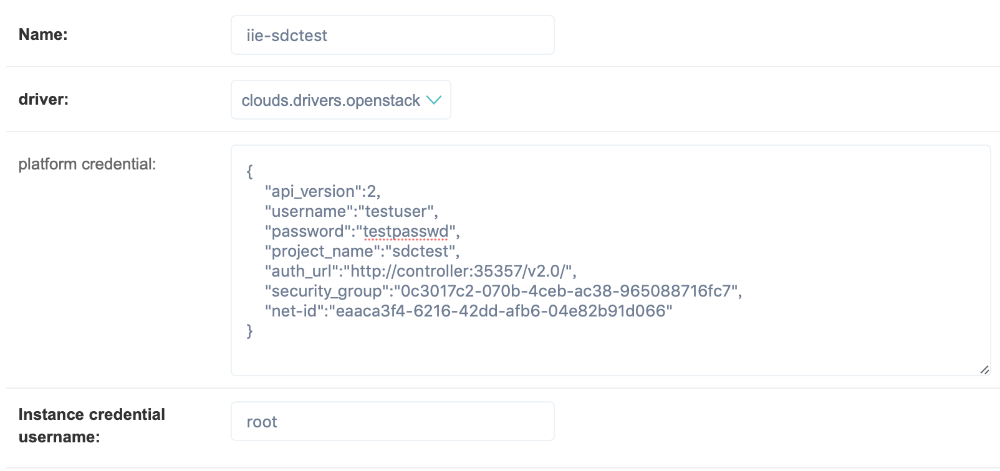
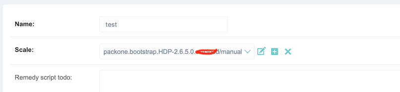
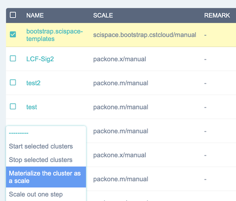

# Introduction
PackOne, is used to simplify big data cluster deployment on the clouds include **OpenStack**, H3CloudOS, EVCloud and CSTCloud etc. PackOne can **bootstrap** a cluster from scratch in a few clicks, and **materialize** the cluster into cloud images to boost following cluster creating procedures. Besides, PackOne can **scale-out**/**in** clusters by onely one click.

The software is inspired by the "serverless" trend in cloud computing and big data processing, has the ambitions to bridge the IaaS to Apache Ambari seamlessly and coordinate Ambari Services into an elastic high-level workspace.

# Install
Choose a linux (Centos 7.5 is verified) host which network can reach the target openstack group resource, and create a postgresql db with its information (db_user, db_passwd, db_host, db_port, db_name) collected. Then run:

pip install pk1

pip install -U pip setuptools

pk1 setup --database db_user:db_passwd:db_host:b_port:db_name

# Start Service
pk1 start [--listening 127.0.0.1:11001]

# Step 1: Add Cloud (OpenStack, for example)
open http://127.0.0.1:11001/clouds/cloud/add/, and fill the form like:

# Step 2: Bootstrap an Ambari cluster
open http://127.0.0.1:11001/engines/cluster/add/, and fill the form like:

# Step 3: Materialize/Scale clusters
open http://127.0.0.1:11001/engines/cluster/, select the target clusters, and click the following materialize.../scale... link:

# Step 4: Boost cluster creation
similar with **Step 1**, open http://127.0.0.1:11001/clouds/cloud/add/, but choose a scale whose name without 'boostrap'.

# Stop
pk1 stop

# Uninstall 
pk1 uninstall

# Acknowledge
National key Research Program of China: Scientific Big Data Management System (No.2016YFB1000600)
